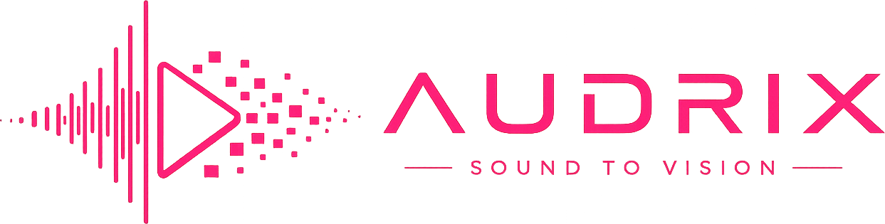

<div align="center">
  
  
---
  
  [](https://audrix.vercel.app)
</div>

---

<div align="center">
  
## Start Creating Now - No Installation Required!

### **👉 [OPEN AUDRIX](https://audrix.vercel.app) 👈**

**Transform your audio into stunning 3D visualizations. Upload audio, choose a visualization, customize effects, and export professional videos — all in your browser!**
</div>

---

<div align="center">


</div>

---

## Overview

**Audrix** is a production-ready audio visualization platform designed for content creators, music producers, DJs, and developers. Create captivating audio-reactive visualizations without requiring any backend infrastructure, subscriptions, or complex setup.

**Key Benefits:**
- ✅ **No Server Required** – 100% client-side processing
- ✅ **Instant Access** – Start creating immediately with built-in sample audio
- ✅ **Professional Output** – Export up to 1440p @ 60 FPS
- ✅ **Open Source** – MIT licensed, fully customizable
- ✅ **Privacy-First** – Your audio never leaves your device

---

## 🎨 Features

### 16 Visualization Modes
Choose from 16 immersive, real-time 3D visualizations that react dynamically to your audio:

| Visualization | Description |
|---|---|
| **Line Spectrum** | Glowing neon frequency wave mirrored symmetrically from the center — erupts into chaotic spikes on bass hits |
| **Spectrum Bars** | Classic frequency-responsive equalizer bars with dynamic color mapping and equal spacing |
| **Circular Spectrum** | 360° frequency visualization radiating from center |
| **Particle Galaxy** | Audio-driven particle system creating an astronomical effect |
| **Audio Sphere** | Morphing 3D sphere responding to bass, mid, and treble frequencies |
| **Wave Tunnel** | Immersive tunnel effect with frequency-responsive waves |
| **Neon Rings** | Concentric rings pulsing with audio intensity |
| **Futuristic Orb** | Advanced sphere with 3D axis warping, gyroscope-precessing rings, and a 600-particle cosmic storm |
| **Cyber Grid** | Grid-based visualization with cyberpunk aesthetics |
| **DNA Helix** | Reactive double helix strand spinning to audio |
| **Starfield** | Hyperspeed star particle movement reacting to audio intensity |
| **Audio Terrain** | 3D landscape mesh distorted by frequency bands |
| **Heartbeat Line** | Reactive heartbeat oscilloscope wave |
| **Möbius Ribbon** | Circular glowing ribbon that deforms into radial frequency waves and twists in 3D |
| **Laser Web** | Floating 3D nodes that form connecting neon laser segments when in proximity — a pulsing neural network |
| **Audio Portal** | Swirling gravitational black hole with lensed particle arches, accretion disk, and Einstein-ring edge |

### Advanced Audio Analysis
- **FFT Analysis** – Real-time Fast Fourier Transform with configurable resolution
- **Frequency Bands** – Dedicated bass, midrange, and treble detection
- **Beat Detection** – Automatic rhythm recognition for synchronized animations
- **Audio Normalization** – Intelligent level adjustment for consistent output

### Player Controls
- **Play / Pause / Stop** – Standard transport controls
- **Seek Scrubbing** – Click or touch-drag the progress bar to jump anywhere in the track
- **Loop Toggle** – Repeat mode that seamlessly loops audio; automatically disabled during video export
- **Volume Control** – Inline volume slider
- **Sample Audio** – Built-in sample track for instant preview without uploading a file

### Visualization Controls
- **Expand / Collapse Preview** – One-click fullscreen visualization mode with the player bar overlaid at the bottom
- **Reset 3D Rotation** – Appears only after you drag-rotate the scene; instantly snaps the camera back to default. Positioned symmetrically to the expand button (bottom-left collapsed, top-left expanded)
- **3D Camera Orbit** – Drag to rotate, scroll to zoom into any visualization
- **Color Presets** – 6 pre-designed palettes for quick styling
- **Background Themes** – 8 background options (dark, light, gradient, void)
- **Fine-tune Parameters** – Adjust sensitivity, rotation speed, and particle count
- **Real-time Preview** – See changes instantly as you adjust settings
- **Keyboard Shortcuts** – Full keyboard control for seamless workflow
- **Mobile-first Responsive Design** – Sticky visualizer preview while settings panels scroll; touch-optimized progress bar scrubbing

### Professional Video Export
- **Multiple Resolutions** – 720p, 1080p, or 1440p output
- **Frame Rate Options** – 30 FPS or 60 FPS rendering
- **Hardware Acceleration** – WebCodecs hardware-accelerated encoding for fast exports
- **Silent Rendering** – Automatically mutes physical speakers during export while preserving the capture stream
- **Interactive Cancellation Overlay** – Glassmorphic progress modal with cancel option; safely disposes encoder resources
- **Frozen Preview** – Blurs main controls and freezes canvas output visually during export for a clean UI
- **Loop-safe Export** – Loop mode is temporarily bypassed during export so the recording halts naturally at track end

### Supported Audio Formats
**MP3 • WAV • M4A • OGG • AAC**

### Browser Compatibility
- Chrome/Chromium 90+ *(recommended for best export performance)*
- Firefox 88+
- Safari 14+
- Edge 90+

---

## 💻 Embed API for Developers

Want to add the Audrix 3D visualization to your own music player, portfolio, or web app? You can use the **Audrix Embed API**!

The embed script allows you to easily render the Audrix canvas inside any `div` and hook it up to your existing `<audio>` element with just a few lines of code.

### Installation

Include the bundled script and CSS directly via CDN (or download them from `dist-api` after building):

```html
<link rel="stylesheet" href="https://cdn.jsdelivr.net/gh/sam-eer31/Audio_Visualizer/dist-api/audrix-api.css">
<script src="https://cdn.jsdelivr.net/gh/sam-eer31/Audio_Visualizer/dist-api/audrix-api.umd.cjs"></script>
```

### Usage Example

```html
<!-- The container where the visualizer will be rendered -->
<div id="audrix-container" style="width: 100%; height: 500px;"></div>

<!-- Your audio element -->
<audio id="my-audio" src="path/to/song.mp3" controls crossorigin="anonymous"></audio>

<script>
  // Initialize the Audrix visualizer
  const visualizer = new window.AudrixVisualizer({
    container: document.getElementById('audrix-container'),
    audioElement: document.getElementById('my-audio'),
    mode: 'particle-galaxy', // Target a specific visualization
    backgroundColor: '#0a0a2e', // Custom background color
    colorPreset: '#00ffcc' // Custom theme color
  });
  
  // You can change styles on the fly!
  // visualizer.setMode('cyber-grid');
</script>
```

---

## 🚀 Getting Started

### Option 1: Use Online (Instant - No Installation)
👉 **[Open Audrix](https://audrix.vercel.app)** ← Click to Start Creating!

1. Upload your audio file — or click **Use Sample Audio** to start instantly
2. Select a visualization mode
3. Customize colors and effects
4. Export as video

### Option 2: Run Locally

```bash
# Clone the repository
git clone https://github.com/sam-eer31/Audio_Visualizer.git
cd Audio_Visualizer

# Install dependencies
npm install

# Start development server
npm run dev
```

The application will open at `http://localhost:5173`

---

## 📚 How to Use

### Step-by-Step Workflow

1. **Upload Audio File**
   - Click the upload button or drag-and-drop your audio file
   - Or click **Use Sample Audio** for an instant demo
   - Supported formats: MP3, WAV, M4A, OGG, AAC

2. **Choose Visualization**
   - Select from 16 unique visualization modes in the Customize panel
   - Preview updates in real-time as you explore

3. **Customize & Refine**
   - Adjust colors, sensitivity, and backgrounds
   - Fine-tune particle effects and rotation speed
   - See changes instantly in the preview

4. **Play & Control**
   - Use player controls or keyboard shortcuts
   - Drag the progress bar to scrub through the track
   - Toggle **Loop** to repeat the track automatically
   - Click **Expand** (bottom-right of preview) for fullscreen visualization
   - Drag to orbit the 3D scene; click **Reset Rotation** (bottom-left) to snap back

5. **Export Video**
   - Select desired resolution (720p, 1080p, 1440p)
   - Choose frame rate (30 or 60 FPS)
   - Click export and download your video

### Keyboard Shortcuts

| Key | Action |
|-----|--------|
| `Space` | Play / Pause |
| `R` | Reset visualization |
| `F` | Toggle fullscreen |
| `E` | Open export panel |

---

## 🏗️ Project Architecture

### Directory Structure

```
src/
├── components/
│   ├── ui/                    # Reusable UI components
│   ├── visualizers/           # 16 visualization implementations
│   ├── preview/               # PreviewBox, PlayerBar & controls
│   ├── export/                # Video export functionality
│   ├── settings/              # Settings & customization panels
│   └── layout/                # App layout & AppLayout
├── hooks/                     # Custom React hooks
│   ├── useAudioAnalyzer.ts    # FFT & frequency band analysis
│   ├── useAudioControls.ts    # Playback, loop & volume control
│   ├── useExport.ts           # WebCodecs video export pipeline
│   └── useKeyboardShortcuts.ts
├── stores/                    # Zustand state management
│   ├── audioStore.ts          # Audio file, playback & loop state
│   ├── visualizerStore.ts     # Mode, color & background state
│   ├── exportStore.ts         # Export progress & snapshot state
│   └── uiStore.ts             # Expanded/collapsed UI state
├── lib/                       # Utility functions & constants
├── types/                     # TypeScript definitions
├── App.tsx                    # Root component
└── main.tsx                   # Entry point
```

### Tech Stack

**Frontend:**
- React 19 – Modern UI library with hooks
- TypeScript – Type-safe JavaScript
- Vite – Fast build tool with HMR

**3D Graphics:**
- Three.js – WebGL 3D library
- React Three Fiber – React renderer for Three.js
- Drei – Helper components and utilities

**Styling & Animation:**
- Tailwind CSS v4 – Utility-first CSS framework
- Framer Motion – Smooth animations and transitions

**State Management:**
- Zustand – Lightweight, fast state management

**Audio & Export:**
- Web Audio API – Real-time audio analysis
- FFT Analysis – Frequency domain analysis
- WebCodecs API – Hardware accelerated VideoEncoder/AudioEncoder
- mp4-muxer – Low-overhead client-side container packaging

**UI Components:**
- Lucide React – Icon library

---

## 🌐 Deploy Your Own

### Deploy to Vercel (Recommended)

1. Push your repository to GitHub
2. Visit [vercel.com](https://vercel.com)
3. Click "Import Project"
4. Select your GitHub repository
5. Click "Deploy"

Your app will be live in minutes with zero configuration.

### Deploy to GitHub Pages

Create `.github/workflows/deploy.yml`:

```yaml
name: Deploy to GitHub Pages

on:
  push:
    branches: [ main ]

jobs:
  deploy:
    runs-on: ubuntu-latest
    steps:
      - uses: actions/checkout@v4
      - uses: actions/setup-node@v4
        with:
          node-version: 20
      - run: npm install
      - run: npm run build
      - uses: peaceiris/actions-gh-pages@v4
        with:
          github_token: ${{ secrets.GITHUB_TOKEN }}
          publish_dir: ./dist
```

### Build for Production

```bash
npm run build
```

---

## 🔧 Development

### Available Commands

```bash
npm run dev          # Start development server with hot reload
npm run build        # Build for production
npm run preview      # Preview production build locally
npm run lint         # Run ESLint checks
```

### Contributing

We welcome contributions! Here's how:

1. Fork the repository
2. Create a feature branch (`git checkout -b feature/your-feature`)
3. Make your changes
4. Commit with clear messages (`git commit -m 'Add your feature'`)
5. Push to your branch (`git push origin feature/your-feature`)
6. Open a Pull Request

**Code Guidelines:**
- Use TypeScript for type safety
- Follow ESLint rules
- Write descriptive commit messages
- Add comments for complex logic

---

## 🐛 Troubleshooting

### Visualization not responding to audio
**Solution:**
- Ensure audio file is in a supported format (MP3, WAV, M4A, OGG, AAC)
- Check browser console for errors (F12)
- Try uploading a different audio file or use the built-in sample

### Poor performance or stuttering
**Solution:**
- Reduce particle count in visualization settings
- Lower FFT size to decrease CPU usage
- Close other browser tabs and applications
- Update graphics drivers
- Ensure GPU acceleration is enabled in browser settings

### Export fails or is very slow
**Solution:**
- Reduce export resolution (start with 720p)
- Close other applications to free up system memory
- Ensure sufficient disk space (~500MB for 1080p video)
- Use Chrome for best WebCodecs hardware acceleration support
- Clear browser cache

### "WebGL not supported" error
**Solution:**
- Update your browser to the latest version
- Check and update GPU drivers
- Try Chrome (best WebGL support)
- Enable hardware acceleration in browser settings

### Audio upload fails
**Solution:**
- Verify file is in supported format (MP3, WAV, M4A, OGG, AAC)
- Check file size is under 500MB
- Remove special characters from filename
- Try re-encoding the audio file

---

## 📋 Use Cases

- 🎵 **Music Videos** – Create stunning audio-reactive music video backgrounds
- 🎬 **Content Creation** – Generate content for YouTube, TikTok, Instagram Reels
- 🎙️ **Streaming** – Twitch stream overlays and background content
- 🎧 **DJ/Live Events** – Real-time visualization during performances
- 📚 **Education** – Visual teaching tool for audio frequency concepts
- 🎨 **Creative Projects** – Any project requiring audio visualization

---

## 📝 License

MIT License – See [LICENSE](LICENSE) file for complete details.

You are free to:
- Use commercially
- Modify and distribute
- Use privately

Simply include the license notice in any distribution.

---

## 📞 Support & Feedback

- **Report Issues** – [GitHub Issues](https://github.com/sam-eer31/Audio_Visualizer/issues)
- **Discussions** – [GitHub Discussions](https://github.com/sam-eer31/Audio_Visualizer/discussions)
- **Live Application** – [https://audrix.vercel.app](https://audrix.vercel.app)

---

<div align="center">

### 👉 **[START CREATING NOW](https://audrix.vercel.app)** 👈

**Made with ❤️ by [sam-eer31](https://github.com/sam-eer31)**

⭐ If you find this useful, please give it a star!

</div>
