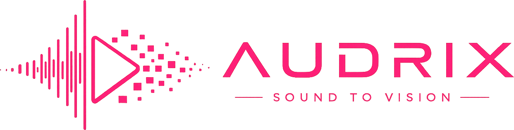

<div align="center">
  

  ---
  **The Next-Generation Web Audio Visualization Engine**

  [](https://audrix.vercel.app)
  
  [](https://opensource.org/licenses/MIT)
  [](https://react.dev)
  [](https://threejs.org)
  [](https://tailwindcss.com)
</div>

---

## 🎵 Bring Your Audio to Life

**Audrix** is a production-ready, client-side audio visualization platform designed for content creators, music producers, DJs, and developers. Built on a modern WebGL stack, it allows you to create captivating, physics-driven 3D visualizations that react dynamically to your music—all directly in your browser.

No backend servers. No software installations. Pure creative freedom.

---

## ✨ Premium Features

### 🌌 20 Immersive 3D Environments
Choose from a curated collection of 20 highly responsive, GPU-accelerated visualizations:

| Visualization | Description |
|---|---|
| **Line Spectrum** | Glowing neon frequency wave mirrored symmetrically |
| **Spectrum Bars** | Classic frequency-responsive equalizer bars |
| **Circular Spectrum** | 360° frequency visualization radiating from center |
| **Particle Galaxy** | Audio-driven particle system creating an astronomical effect |
| **Audio Sphere** | Morphing 3D sphere responding to bass, mid, and treble |
| **Wave Tunnel** | Immersive tunnel effect with frequency-responsive waves |
| **Neon Rings** | Concentric rings pulsing with audio intensity |
| **Futuristic Orb** | Advanced sphere with 3D axis warping and cosmic storms |
| **Cyber Grid** | Grid-based visualization with cyberpunk aesthetics |
| **DNA Helix** | Reactive double helix strand spinning to audio |
| **Starfield** | Hyperspeed star particle movement |
| **Audio Terrain** | 3D landscape mesh distorted by frequency bands |
| **Heartbeat Line** | Reactive heartbeat oscilloscope wave |
| **Möbius Ribbon** | Glowing ribbon that deforms into radial frequency waves |
| **Laser Web** | Floating 3D nodes that form pulsing neural networks |
| **Audio Portal** | Swirling gravitational black hole with lensed particle arches |
| **Beat Dice** | Tumbling 3D dice reacting dynamically to audio beats |
| **Cyber Ribbon** | High-tech neon ribbons weaving through 3D space |
| **Equalizer Matrix** | A massive 3D grid of audio-responsive equalizer pillars |
| **Quantum Supernova** | Explosive stellar particle simulation driven by intense bass |

### 🎛️ Real-Time Precision Control
- **Advanced Audio Analysis** – Real-time Fast Fourier Transform (FFT) with dedicated frequency band detection.
- **Fully Customizable** – Adjust sensitivity, rotation speed, particle density, color palettes (6 presets), and backgrounds (8 options) on the fly.
- **Intuitive Camera** – Drag to orbit the 3D scene, scroll to zoom, and instantly reset rotation with a single click.

### 🎬 Professional Studio Export
- **High-Fidelity Output** – Export your creations locally in **720p**, **1080p**, or **1440p** at **30 FPS** or **60 FPS**.
- **Hardware Acceleration** – Powered by the WebCodecs API for blazing-fast encoding.
- **Clean Rendering** – The UI automatically blurs and freezes during export to dedicate all GPU resources to rendering your high-quality MP4.

### 🎹 Workflow & Controls
- **Supported Formats**: MP3, WAV, M4A, OGG, AAC
- **Keyboard Shortcuts**:
  - `Space`: Play / Pause
  - `R`: Reset visualization rotation
  - `F`: Toggle fullscreen preview
  - `E`: Open export panel

---

## 💻 Developer Embed API

Audrix isn't just a standalone app; it's a powerful engine you can embed into your own projects. 

```html
<!-- Include Audrix API -->
<link rel="stylesheet" href="https://cdn.jsdelivr.net/gh/sam-eer31/Audio_Visualizer/dist-api/audrix-api.css">
<script src="https://cdn.jsdelivr.net/gh/sam-eer31/Audio_Visualizer/dist-api/audrix-api.umd.cjs"></script>

<!-- Setup Container & Audio -->
<div id="audrix-container" style="width: 100%; height: 500px; border-radius: 12px; overflow: hidden;"></div>
<audio id="my-audio" src="track.mp3" controls crossorigin="anonymous"></audio>

<script>
  // Initialize the engine
  const visualizer = new window.AudrixVisualizer({
    container: document.getElementById('audrix-container'),
    audioElement: document.getElementById('my-audio'),
    mode: 'particle-galaxy', // Target any of the 20 modes
    backgroundColor: '#0a0a2e',
    colorPreset: '#FF007F'
  });
</script>
```

---

## 🚀 Getting Started

### Play Instantly (Web App)
👉 **[Launch Audrix Web App](https://audrix.vercel.app)**

### Run Locally (For Developers)
```bash
git clone https://github.com/sam-eer31/Audio_Visualizer.git
cd Audio_Visualizer
npm install
npm run dev
```

---

## 🏗️ Technical Architecture

Audrix is engineered for maximum client-side performance:

- **Core UI**: React 19 + TypeScript
- **Styling**: Tailwind CSS v4 + Framer Motion
- **3D Engine**: Three.js (r184) + React Three Fiber + Drei
- **State Management**: Zustand
- **Audio Processing**: Native Web Audio API + Real-time FFT
- **Video Export**: WebCodecs API + mp4-muxer

---

## 🐛 Troubleshooting

- **No audio reaction?** Ensure file is MP3/WAV/M4A/OGG/AAC.
- **Poor performance?** Reduce particle count in settings, lower FFT size, or ensure hardware acceleration is enabled in your browser.
- **Export slow/failing?** Try 720p first. Ensure you have enough disk space and are using Chrome (best WebCodecs support).

---

## 📝 License

Distributed under the **MIT License**. See `LICENSE` for more information.

<div align="center">
  <br />
  <p>Crafted with precision & passion by <b><a href="https://github.com/sam-eer31">sam-eer31</a></b></p>
  <p>If you love Audrix, please consider giving it a ⭐ on GitHub!</p>
</div>

